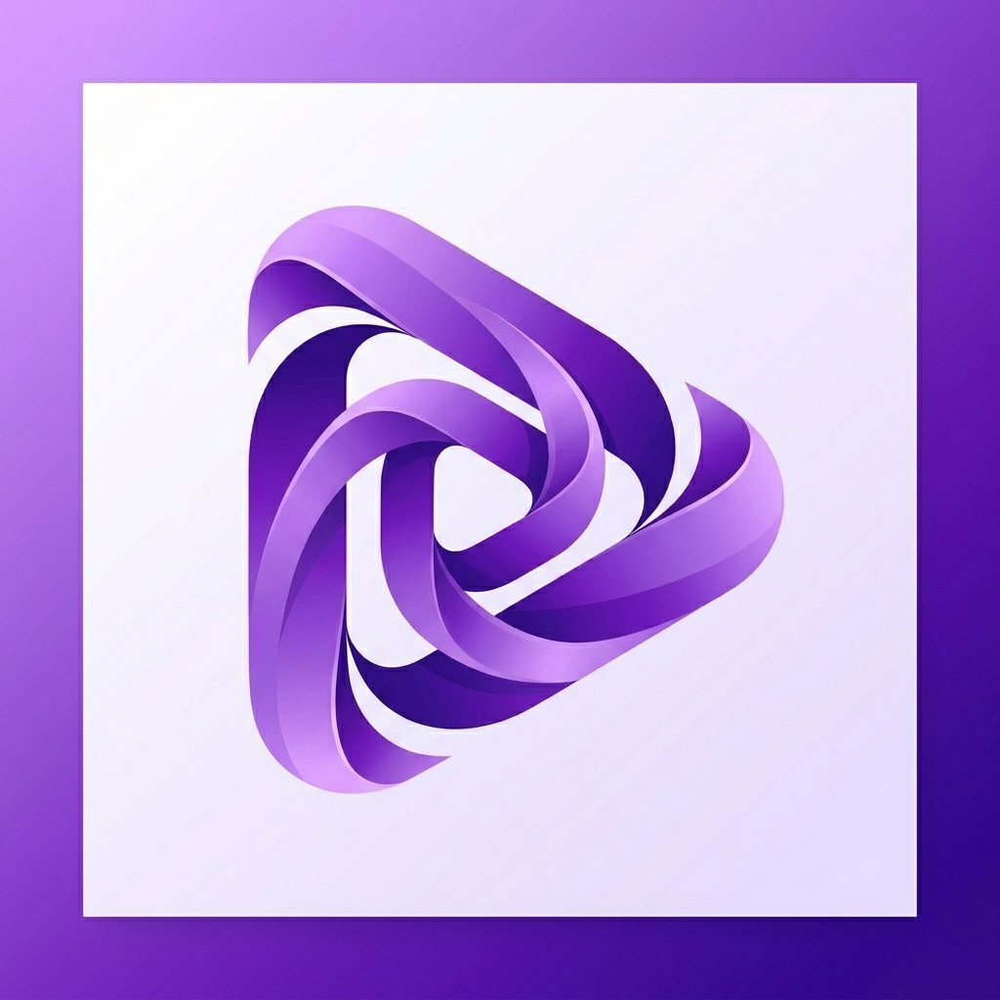

# Lakky Player

<p align="center">
  
</p>

<p align="center">
  <strong>Fast, lightweight desktop media player with real-time 3D anime cel-shaded visuals & modular WebAudio DSP.</strong>
</p>

<p align="center">
  <a href="https://github.com/Laknicek/lakky/releases"></a>
  <a href="https://bun.sh"></a>
  <a href="https://blackboard.sh/electrobun"></a>
  <a href="https://threejs.org"></a>
  <a href="LICENSE"></a>
</p>

---

## Why Lakky?

Most desktop music players are either bloated Electron apps or basic system utilities. **Lakky** is built on **Electrobun + Bun** for instant startup, smooth 60fps playback, and low RAM usage.

It combines real-time **WebAudio DSP graphs**, deep **Binary Anti-Malware / Polyglot file inspection**, and an audio-reactive **3D Anime Cel-Shaded World** (Gerstner ocean waves, Ghibli fluffy foliage, and floating sakura petals).

---

## Key Highlights

### 🌸 3D Anime Cel-Shaded Scene
- **Gerstner Ocean Waves**: Stepped toon color ramps, foam crests, and specular glints reacting to live bass transients.
- **Fluffy Ghibli Foliage**: Normal-mapped anime leaf clumps with wind displacement synced to audio mids.
- **Sakura Petal Physics**: Drifting cherry blossoms, fireflies, and particle turbulence.
- **4 Presets**: `Sakura Sunset`, `Ocean Shinkai`, `Cyber Lake`, `Ghibli Forest`.

### 🛡️ Zero-Trust Binary Anti-Malware Armor
- **Magic Header Verification**: Instantly catches disguised executables (`.exe`, `.scr`, `.bat`, `.ps1`, `.vbs`, `.lnk`, `.dll`, `.elf`) masquerading as `.mp3`/`.flac`/`.mp4`.
- **Polyglot & Stego Scanner**: Scans ID3 padding, MP4 atoms (`moov`/`mdat`), and RIFF chunks for embedded `MZ`/`PE` payloads or ZIP polyglots.
- **In-App Inspection Modal**: Clear safety shields and one-click security audit reports.

### 🎧 Infinite Codec Support & 1-Click Default Player
- **Lossless Audio**: FLAC (up to 24-bit/192kHz), ALAC, WAV, AIFF, APE, WavPack, DSD (DSF/DFF), Opus, OGG, AAC, M4A, MP3, MIDI, Tracker MOD/XM/S3M/IT.
- **Video Containers**: MP4, MKV, WebM, MOV, AVI, WMV, FLV, TS, M2TS, VOB, RMVB.
- **1-Click Default Player**: Set Lakky as default player for 60+ audio & video file types in Windows Settings with one click.

### 🎛️ 8D Spatial Audio & DSP Node Editor
- Modular drag-and-drop audio graph: **8D Binaural Rotating Panner**, **Anime Lo-Fi Tape Saturator**, **Concert Hall Reverb**, **Crystal Vocal Exciter**, **Dynamic Bass Booster**, and 10-band parametric EQ.

### 🚀 Seamless In-App Auto-Updater
- One-click update check with **Stable** & **Canary** channels.
- Live download speed (MB/s), ETA timer, and **SHA-256 integrity verification** before silent installation and relaunch.

### 📱 Synced Lyrics, Mobile Remote & Discord RPC
- **Synced Karaoke Lyrics**: Smooth scrolling highlighting with automatic LRCLIB matching.
- **Mobile LAN Web Remote**: Control playback and browse queue from your phone via QR code.
- **Discord Rich Presence**: Native IPC pipe connection with song progress and album art.

---

## Keyboard Shortcuts

| Key | Action | Key | Action |
| :--- | :--- | :--- | :--- |
| `Space` | Play / Pause | `B` | A-B Loop Repeat |
| `Ctrl + →` / `←` | Next / Previous Track | `M` | Toggle Mute |
| `→` / `←` | Seek ±5s | `S` | Toggle Shuffle |
| `↑` / `↓` | Volume ±5% | `R` | Cycle Repeat (Off / All / One) |
| `F` / `F11` | Fullscreen Mode | `1` - `8` | Switch Views |

---

## Quick Start & Build

```bash
# Clone & install
git clone https://github.com/Laknicek/lakky.git
cd lakky
bun install

# Run dev mode
bun run dev:hmr

# Build production bundle & Windows installer
bun run build
```

---

## License

Released under the [MIT License](LICENSE). Built with Electrobun, Bun, Three.js, and Tailwind CSS.
